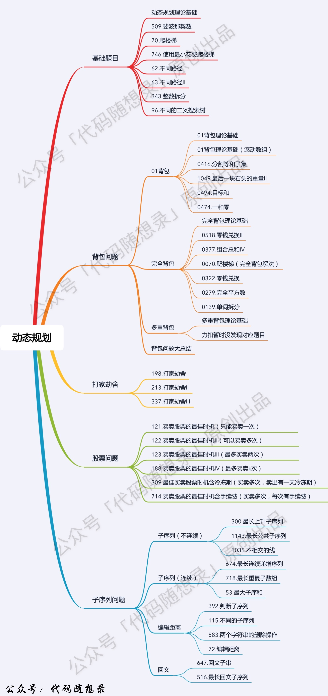

# Notes of Dynamic Programming

## 什么是动态规划

动态规划，英文：Dynamic Programming，简称DP，如果某一问题有很多重叠子问题，使用动态规划是最有效的。

所以动态规划中每一个状态一定是由上一个状态推导出来的， **这一点就区分于贪心** ，贪心没有状态推导，而是从局部直接选最优的，

## 动态规划的解题步骤

**对于动态规划问题，我将拆解为如下五步曲，这五步都搞清楚了，才能说把动态规划真的掌握了！**

1. 确定dp数组（dp table）以及下标的含义
2. 确定递推公式
3. dp数组如何初始化
4. 确定遍历顺序
5. 举例推导dp数组

**如果代码写出来了，一直AC不了，灵魂三问：**

1. 这道题目我举例推导状态转移公式了么？
2. 我打印dp数组的日志了么？
3. 打印出来了dp数组和我想的一样么？

专治各种代码写出来了但AC不了的疑难杂症。

## Reference

[代码随想录 (programmercarl.com)](https://www.programmercarl.com/%E5%8A%A8%E6%80%81%E8%A7%84%E5%88%92%E7%90%86%E8%AE%BA%E5%9F%BA%E7%A1%80.html)
