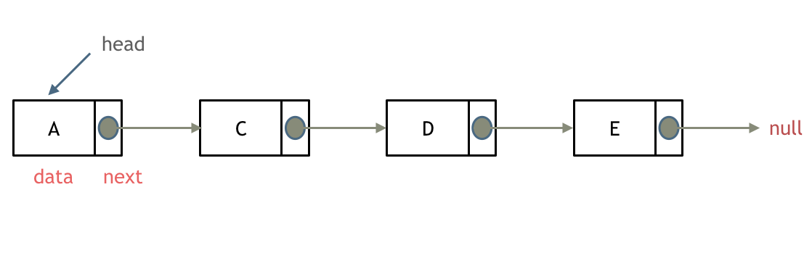
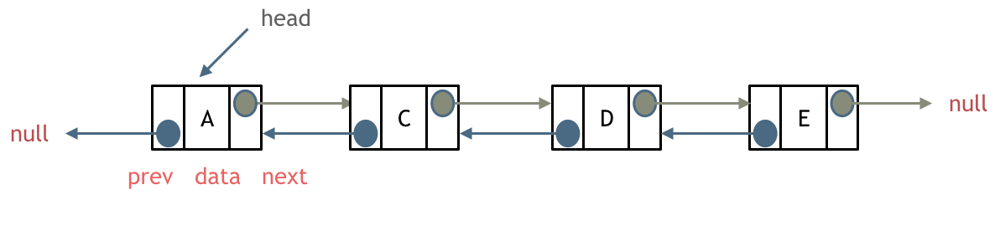
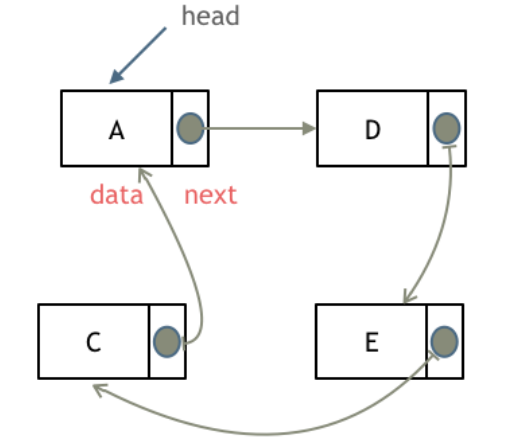
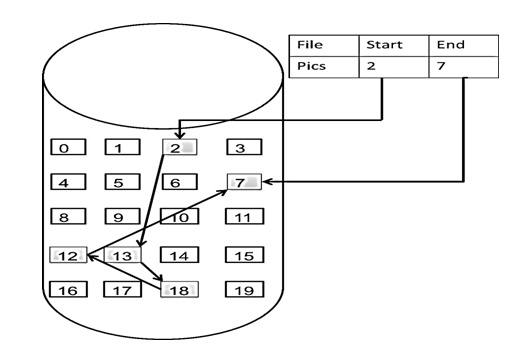
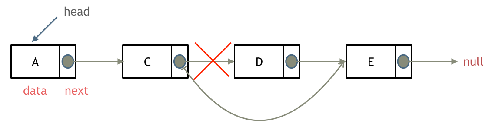
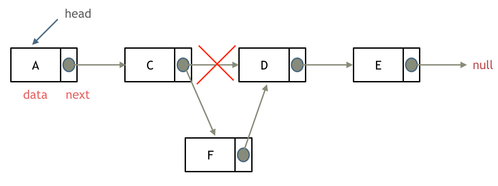
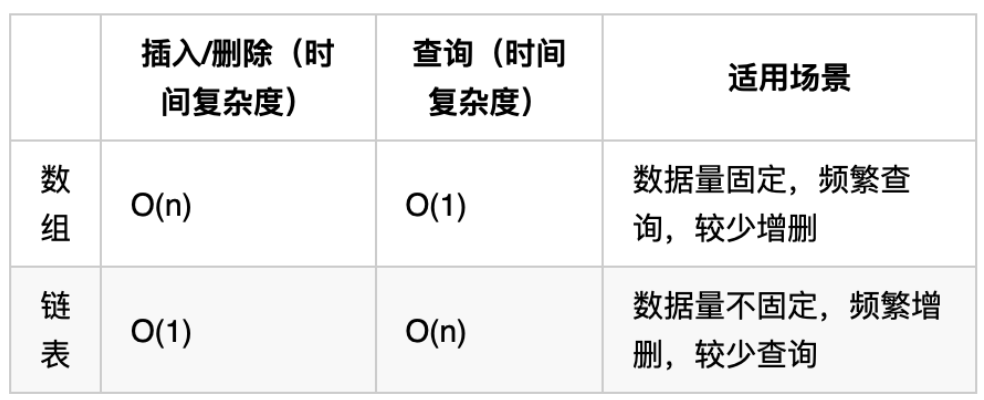

# Notes of Linked List

## 链表的术语定义

链表是一种通过指针串联在一起的线性结构。每一个节点由两部分组成，一个是数据域一个是指针域（存放指向下一个节点的指针），最后一个节点的指针域指向nullptr。

链表的入口节点称为链表的头结点也就是head。



## 链表的类型

### 单链表

刚刚说的就是单链表。单链表中的指针域只能指向节点的下一个节点。

### 双链表

双链表：每一个节点有两个指针域，一个指向下一个节点，一个指向上一个节点。

双链表既可以向前查询也可以向后查询。



### 循环链表

循环链表，顾名思义，就是链表首尾相连。

循环链表可以用来解决约瑟夫环问题。



## 链表的存储方式

数组是在内存中是连续分布的，但是链表在内存中可不是连续分布的。

链表是通过指针域的指针链接在内存中各个节点。

所以链表中的节点在内存中不是连续分布的 ，而是散乱分布在内存中的某地址上，分配机制取决于操作系统的内存管理。



这个链表起始节点为2， 终止节点为7， 各个节点分布在内存的不同地址空间上，通过指针串联在一起。

## 链表节点的定义

链表节点的定义方式如下（C++）：

```cpp
// 单链表
struct ListNode {
    int val;  // 节点上存储的元素
    ListNode *next;  // 指向下一个节点的指针
    ListNode(int x) : val(x), next(NULL) {}  // 节点的构造函数
};
```

也可以不定义构造函数，C++默认生成一个构造函数，但是这个构造函数不会初始化任何成员变量。

通过自己定义构造函数初始化节点：

```cpp
ListNode* head = new ListNode(5);
```

使用默认构造函数初始化节点：

```cpp
ListNode* head = new ListNode();
head->val = 5;
```

所以如果不定义构造函数使用默认构造函数的话，在初始化的时候就不能直接给变量赋值！

## 链表的操作

### 删除节点

删除D节点，如图所示：



只要将C节点的next指针指向E节点就可以了。

那有同学说了，D节点不是依然存留在内存里么？只不过是没有在这个链表里而已。

是这样的，所以在C++里最好是再手动释放这个D节点，释放这块内存。

其他语言例如Java、Python，就有自己的内存回收机制，就不用自己手动释放了。

### 添加节点

如图所示：



可以看出链表的增添和删除都是O(1)操作，也不会影响到其他节点。

但是要注意，要是删除第五个节点，需要从头节点查找到第四个节点通过next指针进行删除操作，查找的时间复杂度是O(n)。

## 性能分析

再把链表的特性和数组的特性进行一个对比，如图所示：



数组在定义的时候，长度就是固定的，如果想改动数组的长度，就需要重新定义一个新的数组。

链表的长度可以是不固定的，并且可以动态增删， 适合数据量不固定，频繁增删，较少查询的场景。

## Reference

[代码随想录 (programmercarl.com)](https://www.programmercarl.com/%E9%93%BE%E8%A1%A8%E7%90%86%E8%AE%BA%E5%9F%BA%E7%A1%80.html)
